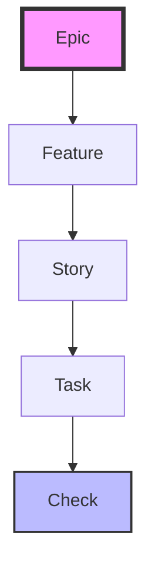

# 🧪 JUnit-Allure Requirement Tracer

[](https://junit.org/junit5/)
[](https://qameta.io/allure/)
[](https://www.oracle.com/java/)

A powerful, requirement-driven testing infrastructure that bridges the gap between YAML-based requirements and Allure-enriched JUnit 5 tests.

---

## 🏗️ Architecture Layers

This project follows a strict 4-layer requirement hierarchy, ensuring every test is traceable back to a business need.



---

## 🚀 Key Features

- **🎯 Requirement Mapping**: Automatically links JUnit tests to YAML-defined requirements.
- **🛡️ Status Precedence**: Correctly distinguishes between **Failed** (Assertions) and **Broken** (Exceptions).
- **🔄 Lazy Evaluation**: Support for `ThrowingFunction` and `ThrowingSupplier` to simulate real-world service calls.
- **📊 Allure Enrichment**: Automatic injection of Epics, Features, Stories, and detailed Check parameters into reports.

---

## 🛠️ Usage Example

### 1. Define your Requirements (`requirements.yaml`)
```yaml
epics:
  - id: "SAMPLE-E-1"
    name: "User Authentication"
    features:
      - id: "SAMPLE-F-1"
        name: "Login Flow"
        stories:
          - id: "SAMPLE-S-1"
            name: "Basic Login"
            tasks:
              - id: "SAMPLE-T-1"
                name: "Validate Credentials"
                checks:
                  - id: "SAMPLE-C-1"
                    scenario: "Correct username/passive"
                    operator: "EQUALS"
                    input: "valid_user"
                    expected: "PASS"
```

### 2. Implement the Test
```java
public class S1_LoginTest extends TestHandler {
    @Test
    void t_1_ValidateCredentials() {
        setTask("SAMPLE-T-1");
        
        check(getTask().checks().get(0), input -> {
            return authService.login(input);
        });
    }
}
```

---

## ⚙️ Configuration

| Property | Description | Default |
|----------|-------------|---------|
| `test.proceed` | Continue execution after failure | `false` |
| `requirements.path` | Path to the YAML resource | `requirements.yaml` |

---

## 📈 Reporting

Generate the report after running tests:
```bash
./gradlew allureReport
./gradlew allureServe
```

---

<p align="center">
  Built with ❤️ for better test traceability.
</p>